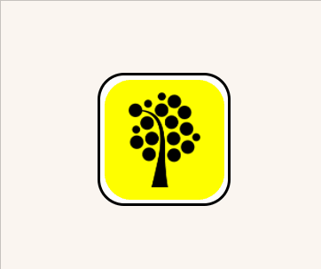

# &lt;my-flipping-tile&gt;

A web component that represents a flipping tile.

## Attributes

### `data-up`

A boolean attribute which, if present, renders the element faced up, showing its front.

Default value: undefined

### `data-disabled`

A boolean attribute which, if present, indicates that the user should not be able to interact with the element.

Default value: undefined

### `data-hidden`

A boolean attribute which, if present, hides the inner of the element and renders an outline.

Default value: undefined

## Methods

### `focus()`

A public method whitch sets focus on the button element in the shadow root.

## Events

| Event Name | Fired When           |
| ---------- | -------------------- |
| `flipTile` | The tile is flipped. |

## Styling with CSS

The front element (div) is styleable using the part `flippingTileFront`.

The back element (div) is styleable using the part `flippingTileBack`.

## Example

```html
<my-flipping-tile>
    
</my-flipping-tile>
```

