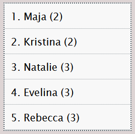

# &lt;my-high-score&gt;

A web component that represents a high score list, presenting users and their score in ascending order.

## Attributes

### `list-length`

An attribute with the value set to a positive integer, representing the length of the list, i.e. the number of results presented.

Default value: `'5'`

### `storage-name`

An attribute with the value set to the name of the key that will hold the game result in local web storage.

Default value: `'game-result'`

## Methods

### `saveResult(data)`

A public method that saves the result of the current quiz round in the local web storage. Its one parameter is an object with two properties:

```js
{
    user: {string},
    score: {number}
}
```

The value for the key `user` must be a string that represents the user's name.

The value for the key `score` must be a number that represents the user's score.

## Example

```html
<my-high-score></my-high-score>
```

