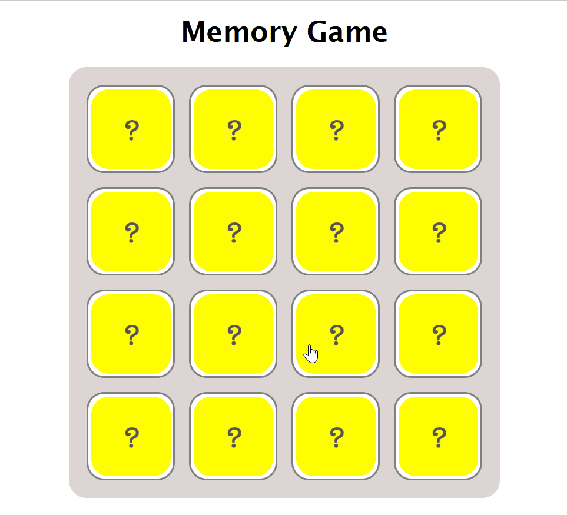

# &lt;my-memory-game&gt;

A web component that represents a memory game.

## Attributes

### `data-board-size`

The `data-board-size` attribute specifies the size of the grid. Its value must be `small` (2x2), `medium` (4x2) or `large` (4x4).

Default value: large

## Events

| Event Name      | Fired When                        |
| --------------- | --------------------------------- |
| `tileMatch`     | The tiles facing up match.        |
| `tileMismatch`  | The tiles facing up do not match. |
| `gameFinished`  | The game is finished.             |

## Example

```html
<my-memory-game></my-memory-game>
```

