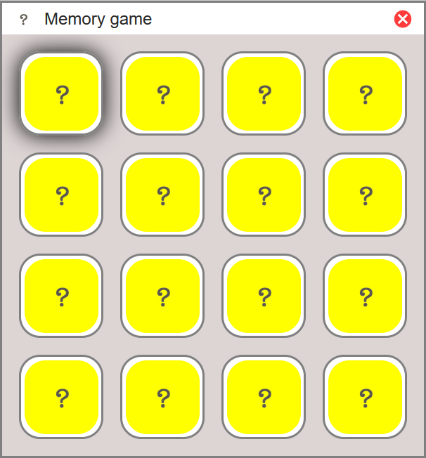

# &lt;my-window&gt;

A web component that represents a desktop window.

## Attributes

### `data-width` & `data-height`

The `data-width` and `data-height` attributes specify the size (in px) of the space held for the app slotted into the app area of the window. If the size of the app exceeds this value, the overflow will be hidden. If it is smaller, the app will be centered horisontally and/or vertically. The value must be set to a number followed by the unit px, for example `300px`.

Default value: 400px

### `data-name`

The `data-name` attribute specifies the name of the app, which is shown in the top bar of the window.

## Events

| Event Name      | Fired When                                                 |
| --------------- | ---------------------------------------------------------- |
| `closeWindow`   | The user clicks on the cross icon in the top right corner. |

## Styling with CSS

The containing element (div) is styleable using the part `window`.

## Named slots

| Slot Name      | Used To                                         |
| -------------- | ----------------------------------------------- |
| `logo`         | Slot an image of the app logo into the top bar. |
| `app`          | Slot the app into the app area.                 |


## Example

```html
<my-window>
    
    <my-app slot="app"></my-app>
</my-window>
```

